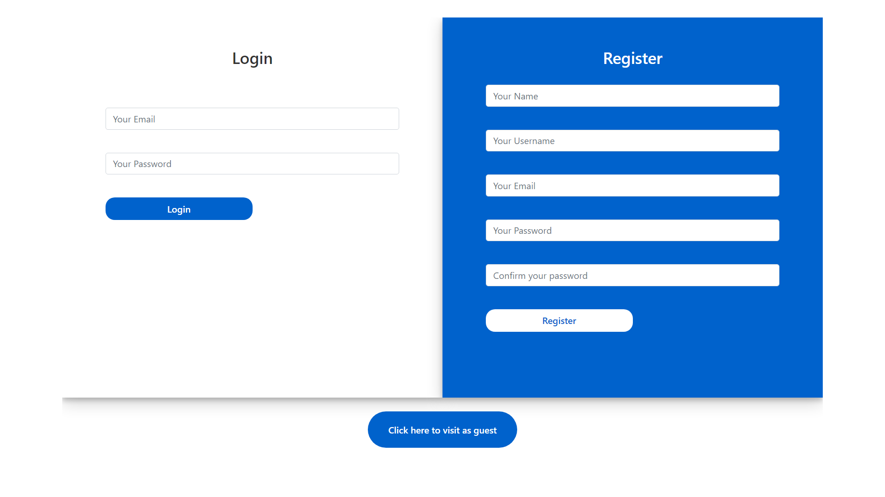
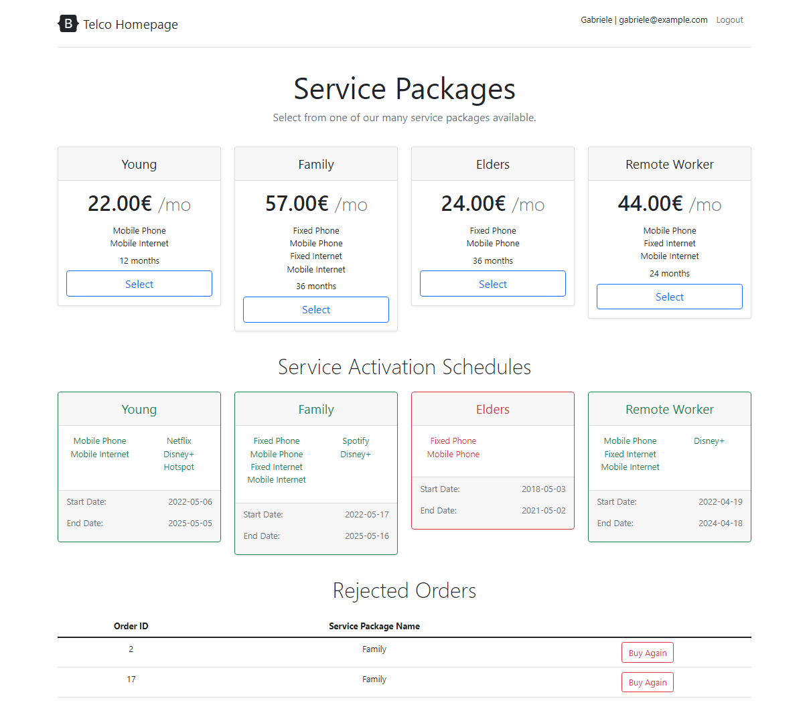
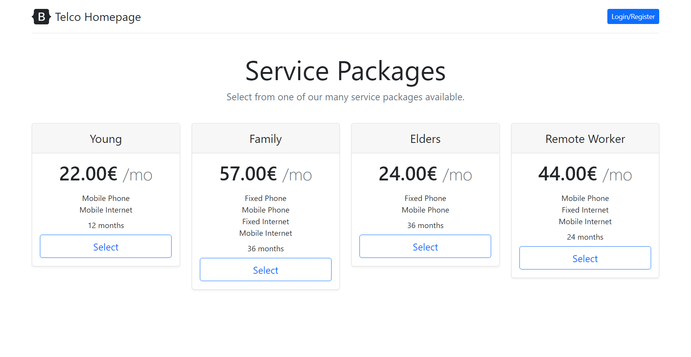
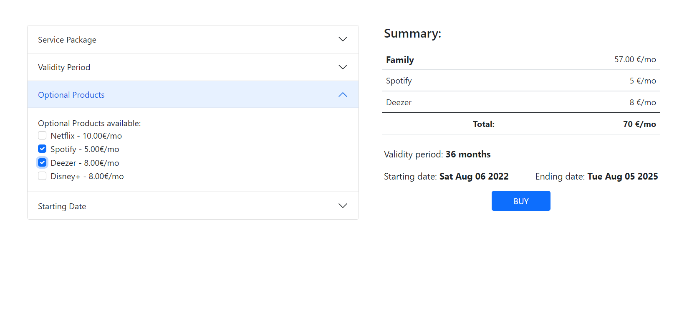
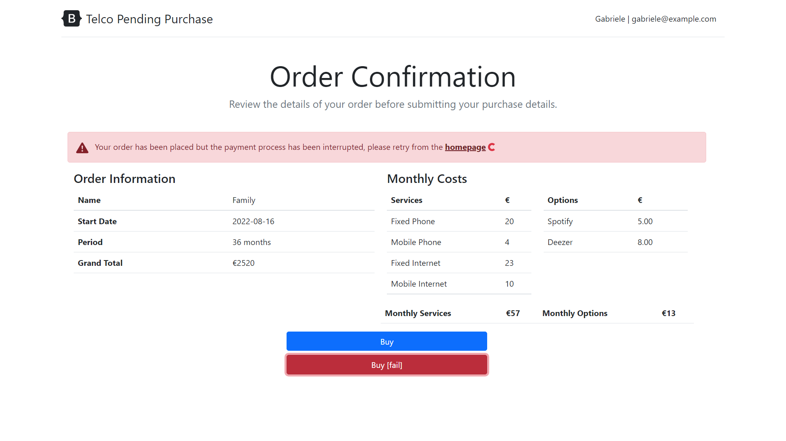
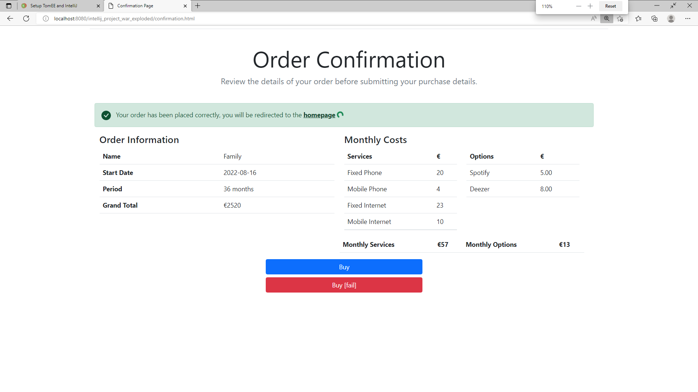
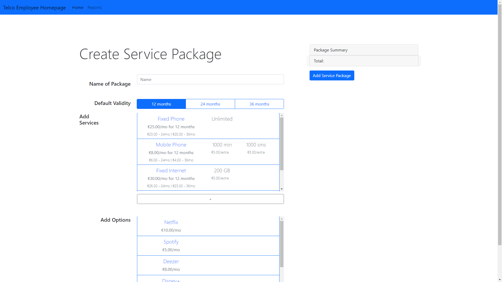
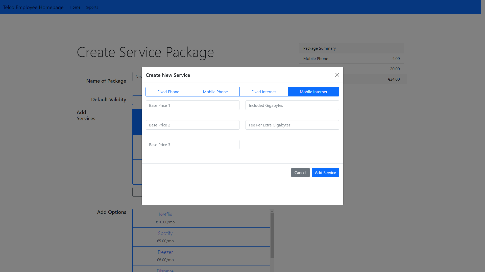
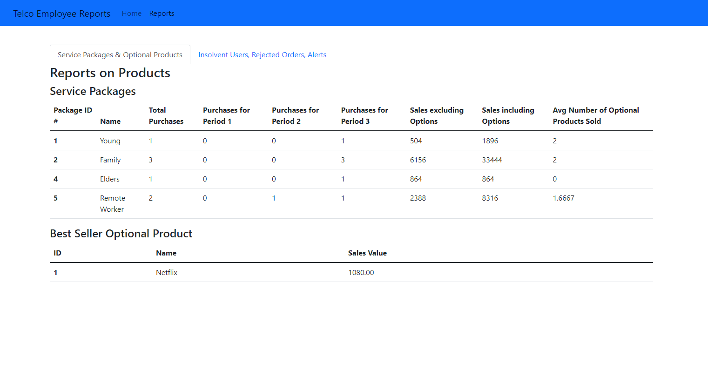
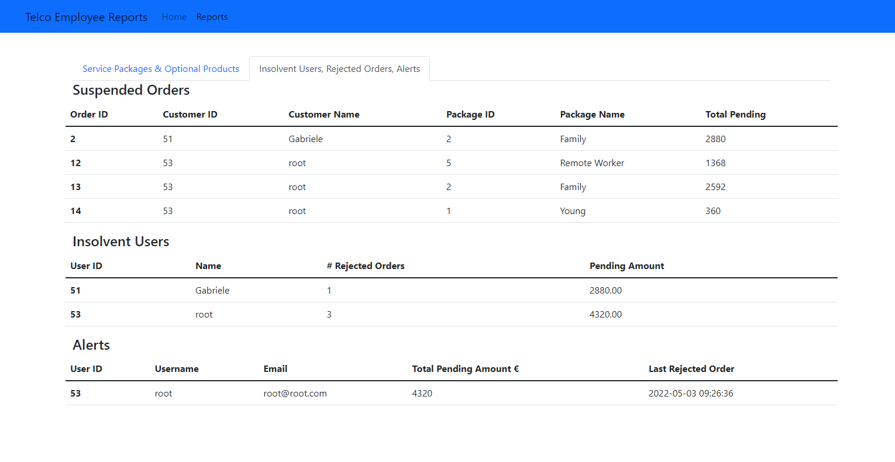

# TelcoService - JavaEE Web Application - Project
Project developed for the examination of the Data Bases 2 course at Politecnico di Milano (A.Y. 2021/2022).

## Specifications
The complete list of specifications can be found [here](./Specifications.pdf).

The aim of this project is to create a telco website, where customers can buy telco products/subscriptions, and registered employees can create new packages to sell to customers, with different optional products and services included. Employees can also see lots of statistics on selling performances.

The **front-end** has been developed with HTML, CSS, and JS, with the use of Bootstrap and Jquery. It communicates with the backend through AJAX requests and JSON responses.

The Apache TommEE **back-end** integrates the Jakarta (Java) Persistence API, which is connected to a  MySQL database and calls an external service to process the payments.

There are two different frontends for the two different types of users, while the backend shares the same database.

## Group members
- **Gabriele Marra** ([@gabrielemarra](https://github.com/gabrielemarra))  
- **Destiny Mora**([@dmora4](https://github.com/dmora4))  

## Screenshots
### Login

### Home Page - Logged and unlogged

### Buy Service Page

### Order Confirmation - Failing and successful

---
### Employee Home Page

### Service Creation

### Statistics

